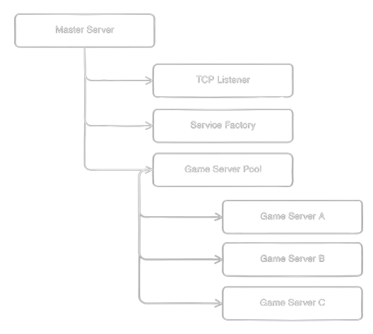

# Login Server
The login server is responsible for managing the initial connection a game client or launcher makes to Imlight. It is also responsible to manage a pool of game servers.

Imlight's architecture makes the login server the master server.

## Game Server Pool
Imlight's game servers are not separate entities like the login and patch servers. Rather, they are pooled under a login server.

To offload the login server, the `GameServerPool` exists as a child actor of the login server; game servers exist as child actors of the `GameServerPool`.

## Queue
The login server does not have a queue. It will accept connections by any means, so long as the connection is unique and the maximum amount of allowed connections it not met.

## Actor Layout

__Figure A.I__ -- Imlight's login server layout.